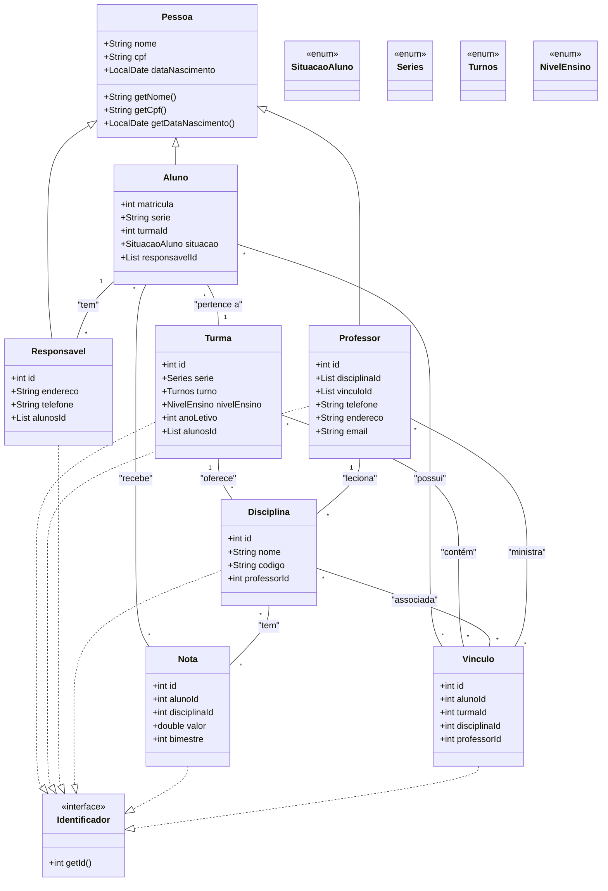

# Gerenciador de Escola

Este projeto é um sistema de gerenciamento escolar desenvolvido em Java, focado na organização e administração de dados de alunos, professores, turmas, disciplinas, notas e responsáveis. Ele oferece uma interface de usuário simples e funcional para facilitar as operações diárias de uma instituição de ensino.

## Descrição do Projeto

O `GerenciadorDeEscola` foi concebido para simular um ambiente de gestão acadêmica, permitindo o cadastro, consulta, edição e exclusão de informações essenciais. A aplicação utiliza persistência de dados em arquivos de texto, demonstrando conceitos de manipulação de I/O em Java e a aplicação do padrão de arquitetura MVC (Model-View-Controller) para uma organização clara e modular do código.

## Funcionalidades Principais

O sistema oferece as seguintes funcionalidades:

- **Gestão de Alunos**: Cadastro, consulta, edição e exclusão de alunos, incluindo informações como matrícula, série, turma, situação e responsáveis.

- **Gestão de Professores**: Cadastro e gerenciamento de professores, com detalhes de contato e disciplinas lecionadas.

- **Gestão de Responsáveis**: Cadastro de responsáveis pelos alunos, com informações de contato e vínculo com os estudantes.

- **Gestão de Disciplinas**: Criação e manutenção de disciplinas, associando-as a professores.

- **Gestão de Turmas**: Organização de turmas por série, turno, nível de ensino e ano letivo, com a alocação de alunos.

- **Gestão de Notas**: Lançamento e consulta de notas para alunos em disciplinas específicas.

- **Gestão de Vínculos**: Estabelecimento de relações entre alunos, turmas, disciplinas e professores.

- **Geração de Boletins**: Cálculo de médias e determinação da situação do aluno (aprovado, recuperação, reprovado) com base nas notas lançadas.

## Tecnologias Utilizadas

- **Java Development Kit (JDK) 25**: Linguagem de programação principal.

- **Apache Maven**: Ferramenta para automação de build e gerenciamento de dependências.

- **Swing**: Toolkit para desenvolvimento da interface gráfica de usuário (GUI).

- **Persistência em Arquivos de Texto**: Armazenamento de dados em arquivos `.txt` (sem uso de banco de dados relacional).

## Arquitetura do Sistema

O projeto segue o padrão de arquitetura **Model-View-Controller (MVC)**, que separa a aplicação em três componentes principais:

- **Model (****`br.com.model`****)**: Contém a lógica de negócios e a representação dos dados (entidades como `Aluno`, `Professor`, `Turma`, `Disciplina`, `Nota`, `Responsavel`, `Vinculo`). Inclui também DTOs e enums.

- **View (****`br.com.view`****)**: Responsável pela interface do usuário. No caso, é implementada com Swing, utilizando `JFrame` e `JTabbedPane` para organizar as diferentes funcionalidades em abas (`AbaAlunos`, `AbaProfessores`, etc.).

- **Controller (****`br.com.controller`****)**: Atua como intermediário entre a View e o Model, processando as entradas do usuário, atualizando o Model e selecionando a View apropriada para exibição.

- **DAO (****`br.com.dao`****)**: Camada de acesso a dados, responsável pela persistência e recuperação das entidades em arquivos de texto.

- **Service (****`br.com.service`****)**: Contém a lógica de negócio mais complexa e orquestra as operações entre os DAOs e os Controllers.

- **Util (****`br.com.util`****)**: Classes utilitárias para validações, geração de IDs e outras funções auxiliares.

A persistência dos dados é realizada diretamente em arquivos de texto localizados no diretório `GerenciadorDeEscola/arquivos/`. Cada entidade possui um arquivo correspondente (ex: `alunos.txt`, `disciplinas.txt`), onde os dados são armazenados em formato de texto delimitado por `;`.

## Modelagem de Dados (Diagrama de Classes)

O diagrama de classes a seguir ilustra as principais entidades do sistema e seus relacionamentos:



## Estrutura do Projeto

```
GerenciadorDeEscola/
├── GerenciadorDeEscola/
│   ├── arquivos/                 # Arquivos de persistência de dados
│   │   ├── alunos.txt
│   │   ├── disciplinas.txt
│   │   ├── notas.txt
│   │   ├── professores.txt
│   │   ├── responsaveis.txt
│   │   ├── turmas.txt
│   │   └── ... (outros arquivos de dados)
│   ├── pom.xml                   # Configurações do Maven
│   └── src/
│       └── main/
│           └── java/
│               └── br/com/
│                   ├── Main.java           # Ponto de entrada da aplicação
│                   ├── controller/         # Lógica de controle
│                   │   ├── AlunoController.java
│                   │   ├── BoletimController.java
│                   │   └── ...
│                   ├── dao/                # Acesso a dados (persistência em arquivo)
│                   │   ├── AlunoDAO.java
│                   │   ├── DisciplinaDAO.java
│                   │   └── ...
│                   ├── model/              # Entidades, DTOs e Enums
│                   │   ├── entity/
│                   │   │   ├── Aluno.java
│                   │   │   ├── Disciplina.java
│                   │   │   └── ...
│                   │   ├── dto/
│                   │   │   ├── AlunoExibicao.java
│                   │   │   └── ...
│                   │   └── enums/
│                   │       ├── DiaSemana.java
│                   │       └── ...
│                   ├── service/            # Lógica de negócio
│                   │   ├── AlunoService.java
│                   │   ├── BoletimService.java
│                   │   └── ...
│                   ├── util/               # Classes utilitárias
│                   │   ├── BuscaPorId.java
│                   │   ├── ValidarCpf.java
│                   │   └── ...
│                   └── view/               # Interface do usuário (Swing)
│                       ├── AbaAlunos.java
│                       ├── InterfaceEscola.java
│                       └── ...
├── LICENSE                       # Licença do projeto
└── README.md                     # Este arquivo de documentação
```

## Como Executar

Para compilar e executar este projeto, siga os passos abaixo:

### Pré-requisitos

- **Java Development Kit (JDK) 25** ou superior instalado.

- **Apache Maven** instalado e configurado.

### Passos

1. **Clone o repositório:**

   ```bash
   git clone https://github.com/GilvanPedro/GerenciadorDeEscola.git
   ```

1. **Navegue até o diretório do projeto:**

   ```bash
   cd GerenciadorDeEscola/GerenciadorDeEscola
   ```

1. **Compile o projeto usando Maven:**

   ```bash
   mvn clean install
   ```

1. **Execute a aplicação:**

   ```bash
   mvn exec:java -Dexec.mainClass="br.com.Main"
   ```

   Alternativamente, você pode importar o projeto em sua IDE favorita (IntelliJ IDEA, Eclipse, VS Code ) e executá-lo diretamente a partir da classe `br.com.Main`.

## Licença

Este projeto está licenciado sob a licença MIT. Para mais detalhes, consulte o arquivo [LICENSE](LICENSE) no repositório.

---

Desenvolvido por [Gilvan Pedro](https://github.com/GilvanPedro)